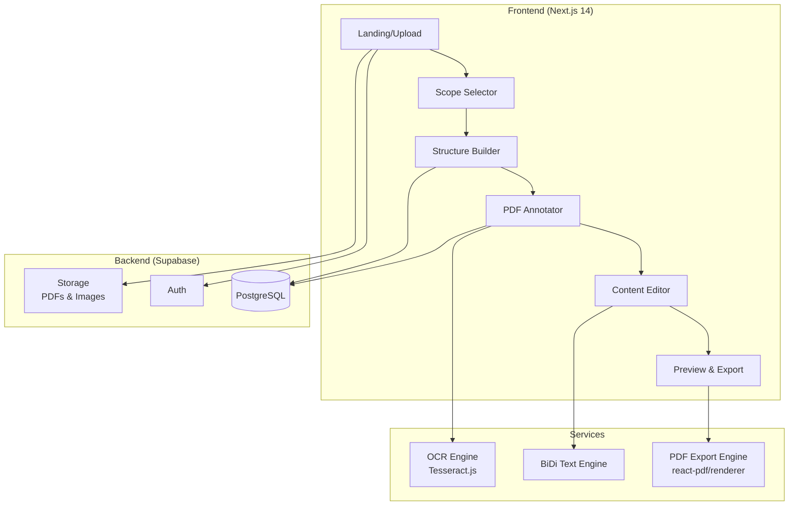

# AKONY — Product Documentation

## 1. Vision & Problem Statement

### The Problem
Teachers in Iraq (and the Arab world) spend **hours** manually creating exams:
- Flipping through textbooks, retyping questions by hand
- Fighting with Word/Google Docs RTL formatting (Arabic text + English math = chaos)
- Creating multiple versions by copy-pasting and shuffling
- No reusable question bank — every semester starts from scratch

### The Solution
**AKONY** is an exam builder that lets teachers:
1. **Upload** their curriculum PDF or textbook photos
2. **Declare** the exam scope (chapters/pages)
3. **Structure** the exam skeleton (question types, sub-questions, rules)
4. **Mark** content by drawing directly on the PDF
5. **Edit** extracted text and modify values
6. **Generate** perfectly formatted, RTL-correct exam documents in multiple versions

### Target Users
- **Primary:** Iraqi high school teachers (physics, math, chemistry)
- **Secondary:** Arab world teachers using similar Arabic curriculum formats
- **Future:** Any teacher worldwide who works with mixed-direction text

---

## 2. Architecture Overview



### Why This Architecture?

| Decision | Choice | Reasoning |
|----------|--------|-----------|
| **Framework** | Next.js 14 (App Router) | SSR for fast loads, API routes, file-based routing, massive ecosystem |
| **UI Library** | shadcn/ui + Tailwind | Free, customizable, accessible, RTL-friendly with CSS logical properties |
| **PDF Viewer** | PDF.js | Free, open-source, the industry standard for browser PDF rendering |
| **Annotation** | Fabric.js | Free, powerful canvas library, supports drawing shapes/text overlays |
| **OCR** | Tesseract.js | Completely free, runs in-browser, supports Arabic + English |
| **Database** | Supabase (PostgreSQL) | Free tier, auth built-in, storage built-in, real-time |
| **Export** | @react-pdf/renderer | Free, generates PDF in browser, full control over RTL layout |
| **State** | Zustand | Lightweight, no boilerplate, supports undo/redo |
| **Animations** | Framer Motion | Premium feel, smooth transitions, gesture support |
| **Hosting** | Vercel | Free tier, auto-deploys from Git, global CDN |

---

## 3. Tech Stack (100% Free)

### Core

| Layer | Technology | Cost | Purpose |
|-------|-----------|------|---------|
| Framework | Next.js 14 | Free | Full-stack React framework |
| Language | TypeScript | Free | Type safety |
| Styling | Tailwind CSS + shadcn/ui | Free | Utility-first CSS + component library |
| Animations | Framer Motion | Free | Smooth UI transitions |
| State | Zustand | Free | Client-side state management |

### AI & Processing

| Technology | Cost | Purpose |
|-----------|------|---------|
| Tesseract.js | Free | In-browser OCR (Arabic + English) |
| PDF.js | Free | PDF rendering in browser |
| Fabric.js | Free | Canvas drawing/annotation |
| Google Cloud Vision API | Free (1K/mo) | Optional: Higher-quality OCR |
| Gemini API | Free tier | Optional: AI question suggestions |

### Backend & Infrastructure

| Technology | Cost | Purpose |
|-----------|------|---------|
| Supabase | Free tier | Auth, DB, Storage |
| Vercel | Free tier | Hosting + CI/CD |
| PostgreSQL (via Supabase) | Free | Relational database |

---

## 4. User Workflow (Step by Step)

### Step 1: Upload Material
```
┌─────────────────────────────────┐
│                                 │
│   📄 Upload your curriculum     │
│                                 │
│   ┌─────────────────────────┐   │
│   │                         │   │
│   │   Drag PDF or images    │   │
│   │   here                  │   │
│   │                         │   │
│   └─────────────────────────┘   │
│                                 │
│   Supported: PDF, JPG, PNG      │
│                                 │
└─────────────────────────────────┘
```

### Step 2: Declare Scope
- Teacher selects page range (e.g., pages 74–92)
- Or types chapter range (e.g., "Chapter 4: Torque and Equilibrium")
- App crops the material to only show relevant pages

### Step 3: Build Exam Skeleton
```
┌──────────────────────────────────────┐
│ Exam Structure                       │
│                                      │
│ [Version A ▼] [Version B] [+ Add]   │
│                                      │
│ ┌──────────────────────────────────┐ │
│ │ Q1: Problem/Calculation      [⋮] │ │
│ │   (no sub-questions)              │ │
│ └──────────────────────────────────┘ │
│ ┌──────────────────────────────────┐ │
│ │ Q2: Problem/Calculation      [⋮] │ │
│ │   (no sub-questions)              │ │
│ └──────────────────────────────────┘ │
│ ┌──────────────────────────────────┐ │
│ │ Q3: Definitions              [⋮] │ │
│ │   ├─ (a) Short Answer            │ │
│ │   └─ (b) Short Answer            │ │
│ └──────────────────────────────────┘ │
│ ┌──────────────────────────────────┐ │
│ │ Q4: Multiple Choice          [⋮] │ │
│ │   ├─ (1) MCQ                     │ │
│ │   ├─ (2) MCQ                     │ │
│ │   ├─ (3) MCQ                     │ │
│ │   └─ (4) MCQ                     │ │
│ └──────────────────────────────────┘ │
│                                      │
│ [+ Add Question]                     │
│                                      │
└──────────────────────────────────────┘
```

### Step 4: Mark Content on PDF
- PDF opens in full-screen viewer
- Teacher circles content with drawing tools
- Labels each region with a question ID
- Side panel shows all assignments

### Step 5: Edit Extracted Content
- OCR extracts text from marked regions
- Teacher corrects any OCR errors
- Modifies values for different versions (e.g., change 20N → 60N)
- Manually types text for definition questions

### Step 6: Preview & Export
- Live preview of the complete exam
- Export as PDF with correct RTL formatting
- Download answer key (separate file)

---

## 5. Database Schema

```sql
-- Users (handled by Supabase Auth)

CREATE TABLE materials (
  id UUID PRIMARY KEY DEFAULT gen_random_uuid(),
  user_id UUID REFERENCES auth.users(id),
  title TEXT NOT NULL,
  file_url TEXT NOT NULL,
  file_type TEXT NOT NULL, -- 'pdf' or 'image'
  page_count INTEGER,
  created_at TIMESTAMPTZ DEFAULT NOW()
);

CREATE TABLE exams (
  id UUID PRIMARY KEY DEFAULT gen_random_uuid(),
  user_id UUID REFERENCES auth.users(id),
  material_id UUID REFERENCES materials(id),
  title TEXT NOT NULL,
  scope_start_page INTEGER,
  scope_end_page INTEGER,
  scope_chapters TEXT,
  created_at TIMESTAMPTZ DEFAULT NOW(),
  updated_at TIMESTAMPTZ DEFAULT NOW()
);

CREATE TABLE exam_versions (
  id UUID PRIMARY KEY DEFAULT gen_random_uuid(),
  exam_id UUID REFERENCES exams(id) ON DELETE CASCADE,
  label TEXT NOT NULL, -- 'A', 'B', 'C'
  sort_order INTEGER DEFAULT 0
);

CREATE TABLE questions (
  id UUID PRIMARY KEY DEFAULT gen_random_uuid(),
  version_id UUID REFERENCES exam_versions(id) ON DELETE CASCADE,
  question_number INTEGER NOT NULL,
  question_type TEXT NOT NULL,
  -- Types: 'problem', 'definition', 'comparison',
  --        'drawing', 'mcq', 'short_answer'
  instructions TEXT, -- e.g., "Answer 5 out of 6"
  sort_order INTEGER DEFAULT 0
);

CREATE TABLE sub_questions (
  id UUID PRIMARY KEY DEFAULT gen_random_uuid(),
  question_id UUID REFERENCES questions(id) ON DELETE CASCADE,
  label TEXT NOT NULL, -- 'a', 'b', 'c' or '1', '2', '3'
  sub_type TEXT NOT NULL,
  content_text TEXT, -- The actual question text
  source_page INTEGER, -- Which page it was marked from
  source_region JSONB, -- Fabric.js coords of the marked region
  sort_order INTEGER DEFAULT 0
);

CREATE TABLE mcq_options (
  id UUID PRIMARY KEY DEFAULT gen_random_uuid(),
  sub_question_id UUID REFERENCES sub_questions(id) ON DELETE CASCADE,
  label TEXT NOT NULL, -- 'A', 'B', 'C', 'D'
  option_text TEXT NOT NULL,
  is_correct BOOLEAN DEFAULT FALSE,
  sort_order INTEGER DEFAULT 0
);

CREATE TABLE annotations (
  id UUID PRIMARY KEY DEFAULT gen_random_uuid(),
  exam_id UUID REFERENCES exams(id) ON DELETE CASCADE,
  page_number INTEGER NOT NULL,
  fabric_data JSONB NOT NULL, -- Fabric.js serialized canvas
  assigned_to UUID, -- sub_question_id
  ocr_text TEXT,
  created_at TIMESTAMPTZ DEFAULT NOW()
);
```

---

## 6. Key Design Decisions

### RTL-First Design
- All CSS uses **logical properties** (`margin-inline-start` not `margin-left`)
- HTML `dir="rtl"` on root element
- Typography: **IBM Plex Arabic** (body) + **Inter** (UI labels/numbers)
- BiDi text engine isolates English math from Arabic text using Unicode directional markers

### Premium UI/UX
- **Dark mode default** with light mode toggle
- **Glassmorphism** cards with backdrop blur
- **Framer Motion** animations for page transitions and drag-and-drop
- **Micro-interactions:** Satisfying snap when assigning regions, progress indicators
- **Arabic-first typography** with proper line heights for Arabic text (1.8 vs 1.5 for English)

### Offline-Capable (MVP Stretch)
- Zustand state persisted to `localStorage`
- PDF.js and Tesseract.js run entirely in-browser
- Export works without internet
- Supabase sync only needed for save/load/share

---

## 7. MVP Features Checklist

| # | Feature | Priority | Complexity |
|---|---------|----------|------------|
| 1 | PDF upload + page thumbnails | Must Have | Medium |
| 2 | Page range scope selector | Must Have | Low |
| 3 | Exam structure builder (add Q, sub-Q, types) | Must Have | High |
| 4 | Version tabs (A, B, C...) | Must Have | Medium |
| 5 | PDF annotation viewer with drawing tools | Must Have | High |
| 6 | Region-to-question assignment | Must Have | High |
| 7 | OCR text extraction (Tesseract.js) | Must Have | Medium |
| 8 | Content editing + value modification | Must Have | Medium |
| 9 | Live exam preview | Must Have | Medium |
| 10 | PDF export with RTL support | Must Have | High |
| 11 | Dark/light mode | Nice to Have | Low |
| 12 | Exam header customization | Nice to Have | Low |
| 13 | Answer key generation | Nice to Have | Medium |
| 14 | Image upload (not just PDF) | Nice to Have | Medium |

---

## 8. Development Roadmap

### Sprint 1 (Week 1–2): Foundation
- [  ] Project scaffolding (Next.js, Tailwind, shadcn/ui, Supabase)
- [  ] Landing page with upload zone
- [  ] PDF processing pipeline (upload → thumbnail generation → storage)
- [  ] Scope declaration screen

### Sprint 2 (Week 3–4): Structure Builder
- [  ] Exam Structure Builder component (questions, types, sub-questions)
- [  ] Version management (tabs, cloning)
- [  ] Drag-and-drop reordering
- [  ] Exam data persistence (Zustand + Supabase)

### Sprint 3 (Week 5–6): PDF Annotation
- [  ] PDF.js viewer integration
- [  ] Fabric.js overlay canvas
- [  ] Drawing tools (circle, rectangle, freehand)
- [  ] Region-to-question assignment flow
- [  ] Assignment sidebar

### Sprint 4 (Week 7–8): Extraction & Export
- [  ] Tesseract.js integration for OCR
- [  ] Content editing interface
- [  ] MCQ options editor
- [  ] BiDi text engine
- [  ] PDF export with @react-pdf/renderer
- [  ] Live preview

### Sprint 5 (Week 9–10): Polish & Launch
- [  ] Dark/light mode
- [  ] Responsive design (mobile-friendly)
- [  ] Exam header customization
- [  ] Answer key generation
- [  ] Performance optimization
- [  ] Deploy to Vercel

---

## 9. File Structure (MVP)

```
AKONY/
├── app/
│   ├── layout.tsx                    # Root layout (RTL, fonts, theme)
│   ├── page.tsx                      # Landing page + upload
│   ├── globals.css                   # Global styles + design tokens
│   ├── exam/
│   │   └── [id]/
│   │       ├── scope/page.tsx        # Scope declaration
│   │       ├── structure/page.tsx    # Exam structure builder
│   │       ├── mark/page.tsx         # PDF annotation
│   │       ├── edit/page.tsx         # Content editing
│   │       └── preview/page.tsx      # Preview & export
│   ├── api/
│   │   ├── upload/route.ts           # PDF upload endpoint
│   │   └── export/route.ts           # Server-side PDF generation
│   └── components/
│       ├── ui/                       # shadcn/ui components
│       ├── UploadZone.tsx
│       ├── PdfThumbnailStrip.tsx
│       ├── PageRangeSelector.tsx
│       ├── ExamStructureBuilder.tsx
│       ├── QuestionCard.tsx
│       ├── SubQuestionRow.tsx
│       ├── VersionTabs.tsx
│       ├── PdfAnnotationViewer.tsx
│       ├── AnnotationToolbar.tsx
│       ├── RegionAssigner.tsx
│       ├── AssignmentSidebar.tsx
│       ├── ExtractedContentEditor.tsx
│       ├── McqOptionsEditor.tsx
│       ├── QuestionPreview.tsx
│       ├── ExamPreview.tsx
│       └── ExamHeader.tsx
├── lib/
│   ├── types/
│   │   └── exam.ts                   # TypeScript types
│   ├── stores/
│   │   ├── examStore.ts              # Zustand exam state
│   │   └── annotationStore.ts        # Zustand annotation state
│   ├── services/
│   │   ├── ocrService.ts             # Tesseract.js wrapper
│   │   ├── examGenerator.ts          # Exam assembly logic
│   │   ├── pdfExporter.ts            # PDF generation
│   │   └── bidiTextEngine.ts         # Arabic/English BiDi handling
│   ├── hooks/
│   │   ├── usePdfRenderer.ts         # PDF.js hook
│   │   └── useFabricCanvas.ts        # Fabric.js hook
│   └── supabase/
│       ├── client.ts                 # Browser client
│       ├── server.ts                 # Server client
│       ├── schema.sql                # Database schema
│       └── queries.ts                # Data access functions
├── public/
│   └── fonts/                        # IBM Plex Arabic + Inter
├── tailwind.config.ts
├── next.config.mjs
├── package.json
└── tsconfig.json
```
