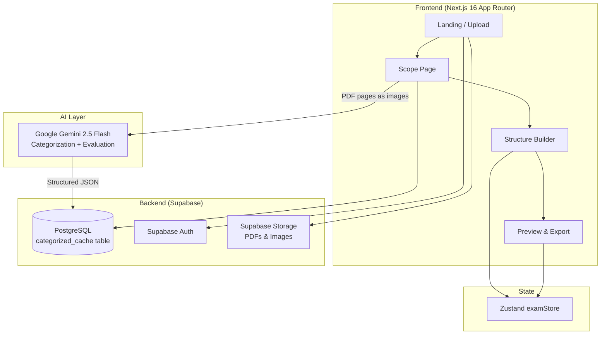

# AKONY — Product Documentation

> **Last Updated:** March 2026  
> **Status:** Phase 3 complete — actively being polished

---

## 1. Vision & Problem Statement

### The Problem
Teachers in Iraq (and the Arab world) spend **hours** manually creating exams:
- Flipping through textbooks, retyping questions by hand
- Fighting Word/Google Docs RTL formatting (Arabic text + English math = chaos)
- Creating multiple versions by copy-pasting and shuffling
- No reusable question bank — every semester starts from scratch

### The Solution
**AKONY** is an AI-powered exam builder that lets teachers:
1. **Upload** their curriculum PDF
2. **Scope** the exam to a page range
3. **Analyze** the document with Google Gemini Vision AI (generative extraction — not just copying)
4. **Structure** the exam using AI suggestions (categories, difficulty levels) or quick-start templates
5. **Edit** extracted content, MCQ options, difficulty, and answer space settings
6. **Evaluate** the exam structure with AI feedback
7. **Preview & Export** a perfectly formatted, RTL-correct PDF

### Target Users
- **Primary:** Iraqi high school teachers (physics, math, chemistry)
- **Secondary:** Arab world teachers using similar Arabic curriculum formats
- **Future:** Any teacher working with mixed-direction text

---

## 2. Architecture Overview



### Architecture Decisions

| Decision | Choice | Reasoning |
|----------|--------|-----------|
| **Framework** | Next.js 16 (App Router) | SSR, API routes, file-based routing |
| **UI Library** | shadcn/ui + Tailwind CSS | Free, accessible, RTL-friendly |
| **Vision AI** | Google Gemini 2.5 Flash | Best Arabic multimodal model — free tier |
| **Database** | Supabase (PostgreSQL) | Free tier, auth built-in, real-time |
| **PDF Parsing** | PDF.js → images → Gemini | Pages rendered as images for Vision AI |
| **Export** | @react-pdf/renderer | In-browser RTL PDF generation |
| **State** | Zustand | Lightweight, no boilerplate |
| **Animations** | Framer Motion | Premium feel, smooth transitions |
| **Caching** | Supabase `categorized_cache` | SHA-256 hash of PDF content = stable cache key |

---

## 3. Tech Stack (100% Free Tier)

| Layer | Technology | Purpose |
|-------|-----------|---------|
| Framework | Next.js 16 | Full-stack React |
| Language | TypeScript | Type safety |
| Styling | Tailwind CSS + shadcn/ui | Utility CSS + components |
| Animations | Framer Motion | Micro-interactions |
| State | Zustand | Client-side state |
| Vision AI | Google Gemini 2.5 Flash | Question categorization & evaluation |
| PDF Parsing | PDF.js | PDF → page images |
| Database | Supabase PostgreSQL | Cache + auth + storage |
| Hosting | Vercel | Free tier, auto-deploys |

---

## 4. Implemented Features (Current State)

### ✅ Phase 1 — Core Flow
- PDF upload → page range selection → scope declaration
- Gemini Vision AI analysis of page images into 8 question categories
- SHA-256 content hashing for stable cache keys (same PDF = instant on repeat)
- Supabase caching (first analysis stores result, subsequent loads are instant)
- Exam structure builder: add questions, sub-questions, assign types

### ✅ Phase 2 — Smart Builder
- AI categorization into 8 types: definitions, MCQ, problem solving, comparisons, justifications, dependencies, short answers, drawings
- Scrollable suggestion panel per question card, sorted by proximity to difficulty target
- MCQ auto-fill: choices correctly mapped into `McqOption[]` format
- Per-sub-question AI suggestion picker (✨ AI button on each row)
- Deduplication: added suggestions disappear from the suggestion list
- Count-based bulk fill: choose N suggestions to add at once
- Inline MCQ option editing with correct-answer indicator
- RTL math formatting enforcement in AI prompts

### ✅ Phase 3 — Polish & Evaluation
- **Quick-Start Templates:** Monthly quiz, Midterm, Ministerial exam templates pre-populate the structure
- **Global Difficulty Slider:** 1–10 target difficulty reorders AI suggestions in real time
- **AI Exam Evaluation:** `/api/evaluate` endpoint reviews the full exam structure and returns Arabic feedback in a modal
- **MCQ Options Count:** Per-question control (2–6 choices, default 4)
- **Answer Space Lines:** Per-question control (0–15 blank lines printed, default 0 — students use separate notebooks in Iraq)
- **PDF Preview & Export:** Correctly formatted RTL exam with question numbering
- **Generative AI Prompt:** Gemini now DERIVES questions (comparisons from paired definitions, علل from cause-effect text, fresh numerical problems with changed numbers, drawing questions from circuit descriptions)
- **Difficulty Spread:** Explicit rubric (1=recall → 10=synthesis) prevents clustering at 5
- **Large PDF Chunked Caching:** The PDF is chunked into 8-page blocks and cached granularly in Supabase, preventing API payload limits.
- **Improved Adding Workflow:** Explicit AI subquestion count selection and instant "Swap `< >`" mechanics right on the question lines.
- **Strict Figure Bans:** Absolute negative constraints in Gemini Prompt prevent the generation of textbook-dependent figure references for pure text output.
- **Bulletproof PDF Engine:** Swapped dynamic Google Fonts to a local Amiri TTF to permanently fix the "Unknown font format" crashes in `@react-pdf/renderer`.
- **Navigation Fixes:** Resolved structure builder routing (e.g. fixing 404 from earlier step names).

---

## 5. Current Database Schema

### `categorized_cache` (only active table in Supabase)
```sql
CREATE TABLE categorized_cache (
  id UUID PRIMARY KEY DEFAULT gen_random_uuid(),
  material_id TEXT NOT NULL,   -- SHA-256 hash of first 80KB of PDF content
  start_page INTEGER NOT NULL,
  end_page INTEGER NOT NULL,
  data JSONB NOT NULL,         -- Full categorized output from Gemini
  created_at TIMESTAMPTZ DEFAULT NOW(),
  UNIQUE (material_id, start_page, end_page)
);
```

> **Note:** The `exams`, `questions`, `sub_questions`, `mcq_options`, `annotations` tables are planned but not yet migrated to Supabase. All exam state is currently managed client-side via Zustand and not persisted between sessions.

---

## 6. API Endpoints

### `POST /api/categorize`
- **Input:** `{ images: string[] }` — array of base64 data URLs (one per PDF page)
- **Output:** Structured JSON with 8 question-type arrays, each item has `{ text, difficulty, requiresIllustration, context, options? }`
- **Caching:** Caller checks Supabase cache before calling; result is written back to cache after AI response

### `POST /api/evaluate`
- **Input:** `{ exam: ExamVersion }` — full exam structure
- **Output:** `{ feedback: string }` — Arabic-language AI feedback on balance, difficulty, and suggestions
- **Model:** Gemini 2.5 Flash

---

## 7. User Workflow (Current)

```
1. Upload PDF
2. Select page range (scope)
   └─ SHA-256 hash computed from PDF content → stable materialId
3. Gemini analyzes pages (or instant cache hit)
4. Structure page:
   ├─ Choose template OR build manually
   ├─ Global difficulty slider (1–10)
   ├─ Add question cards (type, instructions, MCQ count, answer space)
   ├─ Pick from AI suggestion panel (scroll + individual add OR bulk count-add)
   ├─ Per-sub-question AI picker for precise control
   └─ Evaluate exam structure (AI modal feedback)
5. Preview → Export PDF
```

---

## 8. Known Issues & Needs Improvement

| Area | Issue | Priority |
|------|-------|----------|
| **Categorization at scale** | Current approach sends ALL pages in one Gemini call — breaks at ~50+ pages | 🔴 High |
| **Exam persistence** | Exam state is lost on page refresh (Zustand not persisted to DB yet) | 🔴 High |
| **MCQ duplicate choices** | Gemini occasionally generates near-identical MCQ options despite prompt instruction | 🟡 Medium |
| **Difficulty scoring consistency** | AI-rated difficulties still cluster despite explicit rubric (prompt improvement may help) | 🟡 Medium |
| **Drag-and-drop reordering** | Questions can't be reordered by dragging within the structure builder | 🟡 Medium |
| **Answer key generation** | No separate answer key is exported | 🟡 Medium |
| **Exam header customization** | School name, date, grade are not yet configurable on the preview | 🟡 Medium |
| **Multiple exam versions** | Version B/C support exists in types but isn't yet wired to the UI | 🟡 Medium |
| **No login/auth UI** | Supabase Auth is configured but there's no sign-in flow | 🔵 Low |
| **Mobile responsiveness** | Not optimized for mobile screens | 🔵 Low |

---

## 9. Suggested Features (Next Development Sessions)

### High Priority (Core Robustness)

#### 🏗 Chunked Caching for Large PDFs
Split any page range into ~8-page chunks. Each chunk is cached independently.
- `categorized_cache` key becomes `(material_id, chunk_start, chunk_end)` (already unique constraint compatible)
- On re-analysis: cached chunks load instantly, only new chunks call Gemini
- 280 pages → 35 chunks → ~3 min first run, instant on repeat
- Handles textbooks without hitting Gemini per-request limits

#### 💾 Exam Persistence to Supabase
Save exam structure to DB so it survives page refresh / return visits.
- `exams` + `questions` + `sub_questions` + `mcq_options` tables
- Auto-save on structure changes (debounced)
- Load exam by `examId` from URL

#### 📋 Multiple Exam Versions (A/B/C)
- Version cloning from the structure builder
- Per-version question shuffling and number substitution

### Medium Priority (UX Polish)

- **Drag-and-drop reordering** of questions and sub-questions (Framer Motion drag already imported)
- **Exam header editor:** School name, date, class, teacher name fields
- **Answer key PDF:** Separate export with answers shown per sub-question
- **MCQ post-processing dedup:** Server-side check after Gemini response to remove near-identical choices before caching
- **Manual annotation mode:** Let teacher highlight a region on the PDF and assign it to a question slot directly

### Lower Priority / Future

- Multi-model parallel AI agents (Groq/Llama + Gemini) for large PDFs — viable once on a paid API key
- Image upload support (not just PDF)
- Student-facing exam delivery mode (online exam with timer)
- Question bank (save extracted questions across multiple PDFs)
- Share exam link with other teachers

---

## 10. File Structure (Current)

```
AKONY/
├── src/
│   ├── app/
│   │   ├── page.tsx                      # Landing page + upload
│   │   ├── globals.css
│   │   ├── exam/[id]/
│   │   │   ├── scope/page.tsx            # PDF upload + page range + hashing
│   │   │   ├── structure/page.tsx        # Exam builder (templates, slider, evaluate)
│   │   │   └── preview/page.tsx          # RTL PDF preview + export
│   │   └── api/
│   │       ├── categorize/route.ts       # Gemini vision categorization
│   │       └── evaluate/route.ts         # Gemini exam evaluation
│   ├── components/
│   │   ├── ui/                           # shadcn/ui base components
│   │   └── QuestionCard.tsx              # Full question card (suggestions, MCQ, sub-Qs)
│   ├── hooks/
│   │   └── useCategorization.ts          # AI analysis + Supabase cache logic
│   └── lib/
│       ├── types/exam.ts                 # All TypeScript types
│       ├── stores/examStore.ts            # Zustand state (exam, material, cache)
│       └── utils/pdfTextExtractor.ts     # PDF.js wrapper
├── product_documentation.md             # This file
├── package.json
└── tsconfig.json
```

---

## 11. Design Principles

- **RTL-First:** All CSS uses logical properties (`margin-inline-start`, `padding-block`). Arabic text rendered at 1.8 line-height.
- **Dark mode default** with glassmorphism card style and Framer Motion transitions
- **Arabic-first:** UI labels and AI prompts are in Arabic. Numbers/math are LTR-isolated.
- **Offline-tolerant:** Core exam building works without internet; Supabase only needed for AI caching and future persistence.
